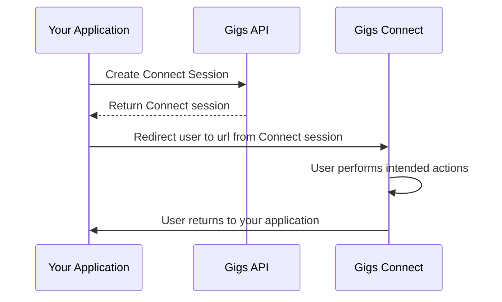

## Prerequisites

In order to use Connect Sessions, you will need:

- A valid API key ([learn how to create one](/api/authentication))
- A project with Connect enabled (reach out to [support@gigs.com](mailto:support@gigs.com) for assistance)

## What Connect Sessions are

Connect Sessions allow developers to streamline the user experience by launching Connect in the state it needs to be in for the user to perform a certain action, eliminating unnecessary steps. This is achieved by specifying an *intent* when creating the Connect Session.

An *intent* could be purchasing a subscription or updating a users' payment method. For a full list of possible intents, please refer to the [API documentation](/api/projects/${GIGS_PROJECT}/connectSessions) or the dedicated sections about intents in this guide.

You can make using Connect smoother for users by automatically filling in data you already have when setting up the Connect Session. This way, users don't have to input information you already have again. For instance, if you're aware of the user's chosen plan and their details, add this information when you create the Connect Session. As a result, users can go straight to the checkout without having to log in again, type in their details a second time, or select a plan.

## How Connect Sessions are created

The flow is initiated by your application making a `POST` request to `/api/projects/${GIGS_PROJECT}/connectSessions`. The Gigs backend creates the Connect Session and returns it to you.
Within the Connect Session, you will find a `url` field that you can use to redirect the user from your application to Connect.
Connect verifies the Connect Session and redirects the user to the desired location (i.e. the checkout with a plan and SIM already selected). In the case of errors, Connect will redirect the user back to a `callbackUrl` you defined.

For more information on creating Connect Sessions, please refer to the [Creating Connect Sessions](/guides/connect/create-sessions) section of this guide.

## Redirecting the user back to your application

If you have defined a `callbackUrl` in the Connect Session, then the user will be redirected to it whenever they have performed the intended action within Connect.
Please refer to the [Linking back to your app](/guides/connect/linking-back-to-app) guide for further information.

## Available intents

### Purchasing & checkout

| Intent | Use case |
| --- | --- |
| [checkoutNewSubscription](/guides/connect/intent-checkout-new-subscription) | How do I let a user purchase a new plan? |
| [checkoutAddon](/guides/connect/intent-checkout-addon) | How do I let a user buy an add-on for their subscription? |

### Subscription management

| Intent | Use case |
| --- | --- |
| [viewSubscriptions](/guides/connect/intent-view-subscriptions) | How do I show a user all their subscriptions? |
| [viewSubscription](/guides/connect/intent-view-subscription) | How do I show a user details of a specific subscription? |
| [changeSubscription](/guides/connect/intent-change-subscription) | How do I let a user upgrade or change their plan? |
| [cancelSubscription](/guides/connect/intent-cancel-subscription) | How do I let a user cancel their subscription? |
| [resumeSubscription](/guides/connect/intent-resume-subscription) | How do I let a user resume a cancelled subscription? |

### Payment management

| Intent | Use case |
| --- | --- |
| [confirmPayment](/guides/connect/intent-confirm-payment) | How do I let a user confirm a pending payment? |
| [updatePaymentMethod](/guides/connect/intent-update-payment-method) | How do I let a user update their payment method? |

### Porting & eSIM

| Intent | Use case |
| --- | --- |
| [completePorting](/guides/connect/intent-complete-porting) | How do I let a user complete number porting? |
| [viewEsimInstallation](/guides/connect/intent-view-esim-installation) | How do I show a user their eSIM installation instructions? |

### User profile

| Intent | Use case |
| --- | --- |
| [updateUserAddress](/guides/connect/intent-update-user-address) | How do I let a user update their address? |
| [updateUserFullName](/guides/connect/intent-update-user-full-name) | How do I let a user update their name? |

## Where to go from here

- Read the [Connect Sessions API Documentation](/api/projects/${GIGS_PROJECT}/connectSessions)
- Read about [Creating Connect Sessions](/guides/connect/create-sessions)
- Reach out to [support@gigs.com](mailto:support@gigs.com) for assistance
