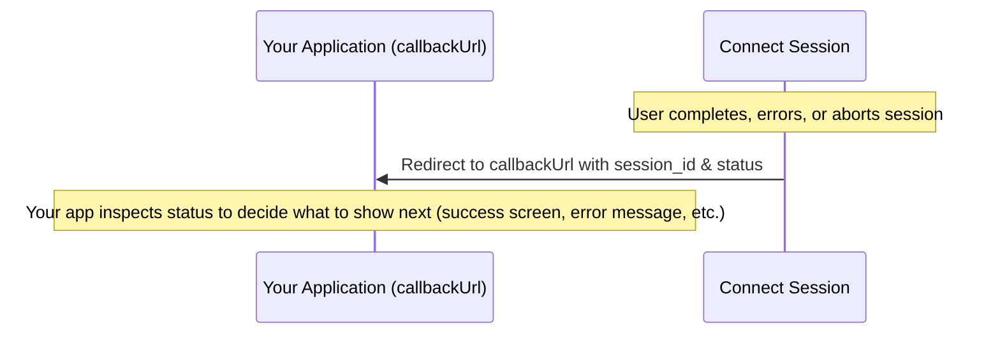

For every [Connect Session](/guides/connect/create-sessions), it is possible to define a `callbackUrl`. Connect redirects the user to this URL that you host on your site or app when:

1. The user successfully completes the intended action in Connect
2. An error occurs that prevents the user from completing the intended action
3. The user intentionally aborts the Connect Session

Connect will always automatically appends the Connect `session_id` and `status` as query parameters to the `callbackUrl` you provide. If your `callbackUrl` already contains query parameters, Connect will keep them intact and simply add `session_id` and `status` at the end.

The status parameter tells you the outcome of the Connect Session. For example, whether it was successful, expired, aborted, or failed. Your application should use this value to decide what to show the user next.

<Frame>

</Frame>

The `callbackUrl` can also be a **deep link**, allowing you to take the user to a specific screen in your app after the user leaves the Connect Session.

## Successful action completion

Whenever the user has successfully completed the intended action in Connect, they are redirected to the `callbackUrl` with the following query parameters:

- `session_id`: The ID of the Connect Session that was completed
- `status`: A status code indicating the result of the session. For successful completions, this will always be `success`

| Scenario                | Your `callbackUrl`         | Connect redirects the user to                                |
| ----------------------- | -------------------------- | ------------------------------------------------------------ |
| Link back to your site  | `https://example.com/link` | `https://example.com/link?session_id=csn_123&status=success` |
| Deep link into your app | `myapp://deep-link`        | `myapp://deep-link?session_id=csn_123&status=success`        |

This allows your application to confirm the Connect Session was completed and continue the user flow. For example: by showing a success screen or refreshing subscription details.

## Error handling

It's important to provide users with clear feedback when they are redirected to the `callbackUrl` due to an error.

When an error occurs with the Connect Session, Connect will add specific query parameters to your callback URL to give you information about the issue:

- `session_id`: The ID of the Connect Session that encountered the problem
- `status`: An error code that indicates the reason for the Connect Session's failure

### Status codes

The `status` query parameter will always reflect the result of the Connect Session. Possible values include:

- `auth_expired`: The Connect session was no longer valid when the access attempt was made
- `bad_configuration`: The Connect Session attempted to start a flow that was not allowed for the current configuration
- `user_aborted`: The Connect Session was intentionally aborted by a user action

| Scenario          | Example `callbackUrl` Redirect                                         | Recommended App Behavior                            |
| ----------------- | ---------------------------------------------------------------------- | --------------------------------------------------- |
| Expired session   | `https://example.com/link?session_id=csn_123&status=auth_expired`      | Enable the user to restart the flow                 |
| Bad configuration | `https://example.com/link?session_id=csn_123&status=bad_configuration` | Show an error message and optionally notify support |
| User aborted      | `https://example.com/link?session_id=csn_123&status=user_aborted`      | Return the user to e.g. the subscription overview   |
