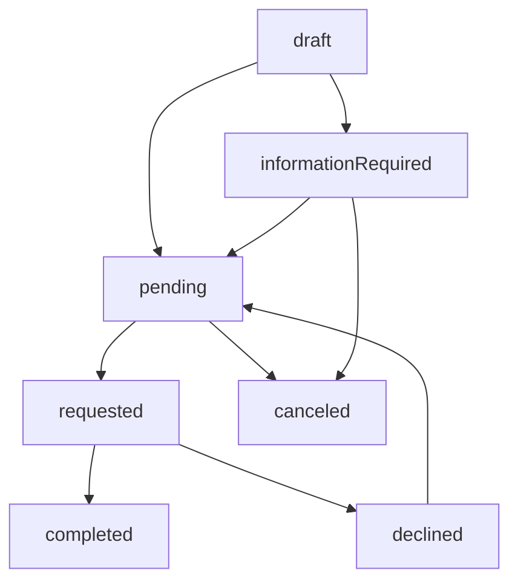
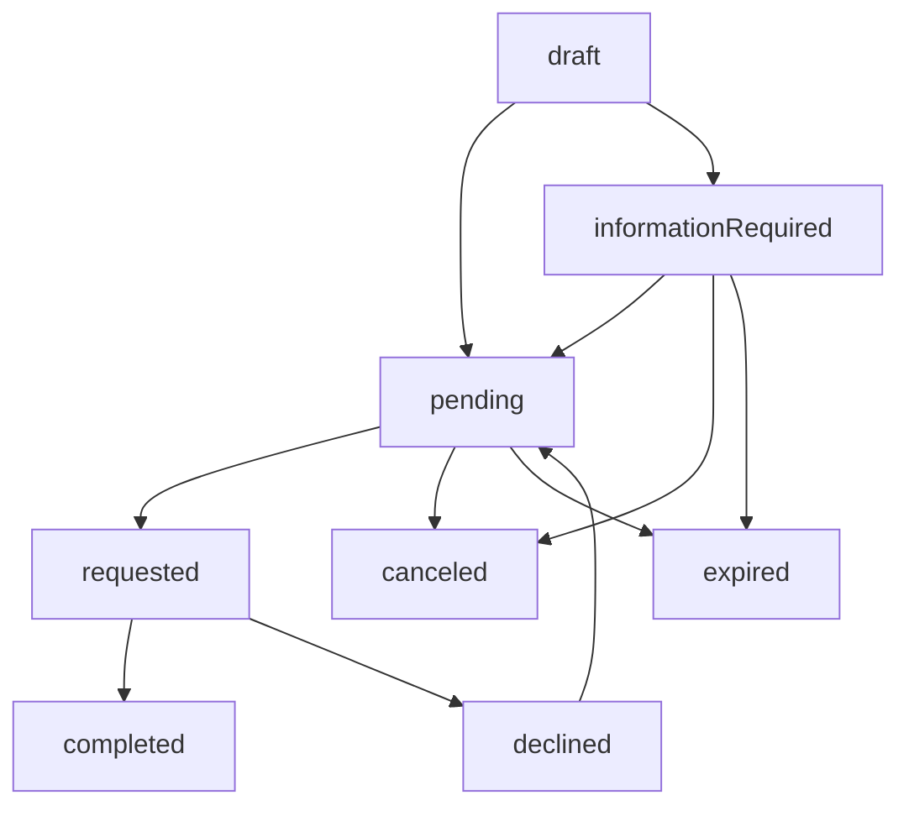

This guide walks you through the process of porting a phone number to Gigs using the Gigs API. Follow these steps to ensure a smooth port-in experience for your users.

## Step-by-Step Porting Guide

1. **Start a Porting Request**

Begin by creating a [porting](/api/gig-core-api/portings/create) with the user's phone number, user ID, and recipient provider. Gigs will check if the number is eligible to be ported.

2. **Create a Subscription**

Create a [subscription](/guides/create-subscription) and reference the porting. If you skip this, a new number will be assigned. The porting status will update to `pending` or `informationRequired`.

3. **Submit Required Information**

Update the porting to provide all information requested by the API. See the `required` attribute in your porting object as requirements vary by country and provider.

4. **Resolve Issues**

If the porting is declined (e.g. due to incorrect information), update the porting with corrected details to retry.

You can also collect all required information before creating the subscription, depending on your workflow and jurisdiction.

Portings have country-specific requirements (e.g. different porting behaviors
in the United Kingdom). See the bottom of this guide for details.

## Porting In Process

### 1. Create a Porting

Create a porting with the desired phone number and provider ID.
On creation, Gigs will check if the provider can accept the number.
If eligible, you'll get a porting with `draft` status.

### Create a porting

```shell
curl --request "POST" \
  --url "/api/projects/${GIGS_PROJECT}/portings" \
  --header "Accept: application/json" \
  --header "Authorization: Bearer ${GIGS_TOKEN}" \
  --header "Content-Type: application/json" \
  --data '{
    "phoneNumber": "+19591234567",
    "provider": "p4",
    "user": "usr_0SNlurA049MEWV4OpCwsNyC9Kn2d"
  }'
```

Draft portings are deleted after 30 days if not used to create a subscription.

### 2. Collect Required Information

Gather the necessary details from the user. The API will list required fields in the `required` property.

For example, US-based providers typically require the current account holder's name, account number and account pin. In some cases, the billing address may also be required.

### A porting with required parameters

```json
{
  "object": "porting",
  "id": "prt_0SNlurA049MEWV39s2kSYqaat7ZS",
  "required": [
    "accountNumber",
    "accountPin",
    "address",
    "firstName",
    "lastName"
  ],
  ...
}
```

Ask the user for this information and update the porting. The porting can't proceed until all required information is provided.

### Update a porting

```shell
curl --request PATCH \
  --url "/api/projects/${GIGS_PROJECT}/portings/${PORTING_ID}" \
  --header "Accept: application/json" \
  --header "Authorization: Bearer ${GIGS_TOKEN}" \
  --header "Content-Type: application/json" \
  --data '{
    "accountNumber": "123456789",
    "accountPin": "1234",
    "address": {
      "city": "New York City",
      "country": "US",
      "line1": "129 West 81st Street",
      "line2": "Apartment 5",
      "postalCode": "10024",
      "state": "NY"
    },
    "firstName": "Jerry",
    "lastName": "Seinfeld"
  }'
```

### 3. Create a Subscription

Create a subscription with the porting to start the process. The porting status will update to `pending` if all information is present.
If information is missing, the status will be `informationRequired`. Continue by updating the porting with the missing details from the `required` property.

The subscription stays `pending` until porting completes or the porting is
canceled. You can cancel the porting or end the subscription if needed.

### 4. Handle Issues

If declined, the porting will show a code and message. Update the porting with corrected information to retry.
Keep an eye on the `required` property in case additional information is needed.

### A declined porting with code and message

```json
{
  "object": "porting",
  "id": "prt_0SNlurA049MEWV39s2kSYqaat7ZS",
  "status": "declined",
  "declinedCode": "portingPhoneNumberPortProtected",
  "declinedMessage": "The phone number has port protection on the provider.",
  ...
}
```

To retry without changes, update the porting with an empty request. Only do
this if the decline wasn't due to missing or incorrect information.

### 5. Wait for Completion

Once all issues are resolved, the porting will complete and the subscription will activate with the ported number.

### A completed porting

```json
{
  "object": "porting",
  "id": "prt_0SNlurA049MEWV39s2kSYqaat7ZS",
  "status": "completed",
  ...
}
```

## Porting Lifecycle

Porting involves several parties and can take minutes to days. The `status` field tracks progress.

### Porting Statuses

Below is a summary of each porting status and what to do next. The cancelable column indicates whether a porting can be canceled in that status.

| Status                | Description                                                                 | Action                                                                                  | Cancelable |
| --------------------- | --------------------------------------------------------------------------- | --------------------------------------------------------------------------------------- | ---------- |
| `draft`               | Porting not used in a subscription yet.                                     | Create a subscription or [request port-in](/api/gig-core-api/portings/update) to start. | No         |
| `informationRequired` | Missing required information.                                               | Collect and update information to continue.                                             | Yes        |
| `pending`             | Awaiting processing by Gigs.                                                | No action needed.                                                                       | Yes        |
| `requested`           | Awaiting processing by providers or scheduled date.                         | No action needed.                                                                       | No         |
| `declined`            | Declined by provider, with reason code/message.                             | Review reason, update information, and retry.                                           | Yes        |
| `completed`           | Porting finished successfully.                                              | No action needed.                                                                       | No         |
| `canceled`            | Porting canceled. Subscription activates with new number.                   | No action needed.                                                                       | No         |
| `expired`             | Porting expired. Subscription ended or remains active with original number. | Start over with new porting and subscription.                                           | No         |

### State Diagrams

**Simplified Porting Lifecycle**

The following state diagram shows the typical porting process with back and forth between user and donor provider or recipient provider. Ultimately, the porting is either completed successfully or canceled by the user.

After creation, the porting is in `draft` mode. It stays in draft mode until it is referenced in a subscription.
From there, the porting either moves to `informationRequired` if required information is missing or to `pending` if all information is present.
Once it is in pending, our system starts processing the porting and requesting the porting.
After the port has been successfully processed, it moves to `completed` or if the port has been declined by the provider it moves to `declined`.
When `declined`, the porting moves back to `pending` once the porting is updated via the API and we start processing the porting again.
This loop continues until the porting is successfully completed.

If at any point in this lifecycle, the user decides not to port their number, the porting can be canceled.
This is permitted unless the port is in the `requested` state and the scheduled date has been reached, if set.
A cancellation of the porting leads to the activation of the attached subscription with a new number.



**Complete Porting Lifecycle**

The following state diagram displays the complete porting lifecycle.
We do not recommend to hardcode these state transitions.



## Porting Decline Codes

Here are the possible decline codes and their meanings. Your app should handle new codes as they are added.

| Code                                    | Description                                         |
| --------------------------------------- | --------------------------------------------------- |
| `portingDeclined`                       | Unknown reason. Contact support.                    |
| `portingPhoneNumberNotEligible`         | Number not eligible for porting.                    |
| `portingPhoneNumberNotFound`            | Number not found with donor carrier.                |
| `portingSameNewAndOldNetworkProvider`   | Same provider for donor and recipient.              |
| `portingUserInformationMismatch`        | Information mismatch with donor carrier records.    |
| `portingPhoneNumberNotActive`           | Number not active with donor carrier.               |
| `portingPhoneNumberAdministrative`      | Number reserved for carrier use.                    |
| `portingPendingOtherProvider`           | Active porting request exists with another carrier. |
| `portingDuplicated`                     | Pending porting request already exists.             |
| `portingPhoneNumberPortProtected`       | Port protection enabled.                            |
| `portingAccountPinRequiredOrInvalid`    | Account PIN required or invalid.                    |
| `portingAccountNumberRequiredOrInvalid` | Account number required or invalid.                 |
| `portingAddressRequiredOrInvalid`       | Address required or invalid.                        |
| `portingPostalCodeRequiredOrInvalid`    | Postal code required or invalid.                    |
| `portingFirstNameRequiredOrInvalid`     | First name required or invalid.                     |
| `portingLastNameRequiredOrInvalid`      | Last name required or invalid.                      |
| `portingBillingPinRequiredOrInvalid`    | Billing pin required or invalid.                    |

## Test Portings

Use our test phone numbers to try porting flows. See the [testing guide](/guides/core/testing/test-phone-numbers) for details.

## Country-specific Considerations

### United Kingdom

See our [UK porting guide](/guides/porting/porting-in-the-uk).

### United States

See our [US porting guide](/guides/porting/porting-in-the-us).
