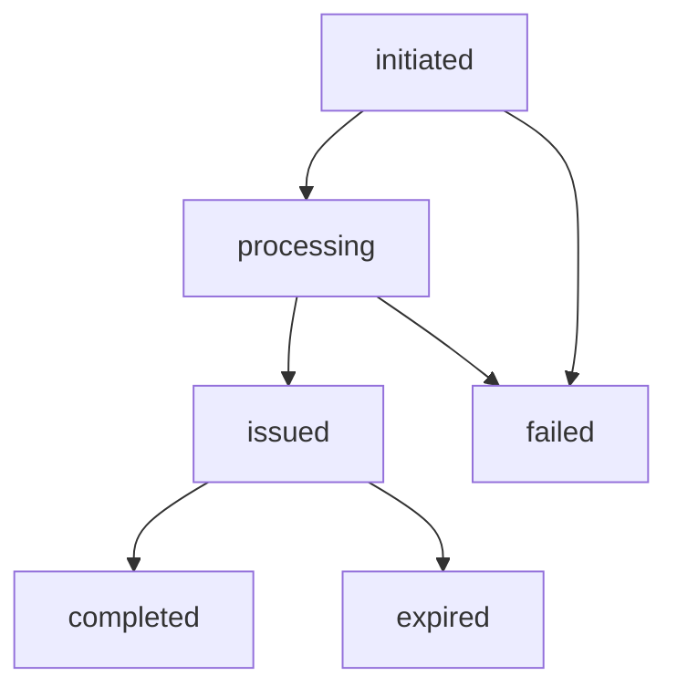

Porting out allows a user to end their subscription and move their phone number from your service to another carrier. In this case, the user will require credentials to authenticate the porting with the recipient provider.
In the Gigs API, this is managed using the port out resource.

This page explains the eligibility rules, provider-specific differences, and the full workflow for creating and completing a port out request through the Gigs API.

## Port out eligibility

A port out can be created if:

- The SIM is `active` or `inactive`.
- The subscription was activated at least once.
- The subscription was not ended more than 30 days ago.

This means a port out can be initiated even after a subscription has ended, as long as the 30-day window hasn't passed. The SIM does not need to be activated on a new subscription.

Provider-specific limitations:

Some providers tie port out eligibility to active subscription status rather than SIM status. For these providers, if the subscription has ended, you'll need to reactivate a subscription on the same SIM before creating a port out. See [Porting out an ended subscription](#porting-out-an-ended-subscription) for the recommended workflow.

Contact your implementation manager to confirm your provider's behavior.

## Porting out prerequisites

Regardless of provider, port out requests require:

- A valid subscription that has been activated at least once.
- An associated SIM that has been activated at least once.
- User identity and account details.

## Porting out process

Before creating a port out, retrieve the subscription to verify the subscription status and review the plan details to confirm the provider.

### 1. Create a port out

To initiate the port out process, create a new port out for the subscription.

### Create a port out

```shell
curl --request "POST" \
  --url "/api/projects/${GIGS_PROJECT}/portOuts" \
  --header "Accept: application/json" \
  --header "Authorization: Bearer ${GIGS_TOKEN}" \
  --header "Content-Type: application/json" \
  --data '{
    "subscription": "sub_0SNlurA049MEWV2gSfSxi00xlPIi"
  }'
```

Port outs are created in a `processing` state.

### A processing port out

```json
{
  "object": "portOut",
  "id": "pto_0SNlurA049MEWV4DWEaT4SaeDI8s",
  "status": "processing",
  ...
}
```

If your project requires user consent, the port out will be created in an `initiated` state, and the user will need to give consent before the port out will transition to `processing`. See the [User Consent](#user-consent) section below for more details.

### 2. Wait for the port out to be issued

After the port out has been created, our system will process it, and issue credentials on the provider.

Once the credentials have been issued, you will receive a `portOut.issued` event.

### An issued port out

```json
{
  "object": "portOut",
  "id": "pto_0SNlurA049MEWV4DWEaT4SaeDI8s",
  "status": "issued",
  ...
}
```

It is also possible to check the status of the port out using the Gigs API. A port out can be retrieved using the `/projects/{project}/portOuts/{portOut}` endpoint, or port outs can be listed using `/projects/{project}/portOuts` (with an optional filter using the `subscription` query parameter).

### 3. Retrieve & share the port out credentials with the user

Once the port out has been issued, you can retrieve the credentials and share them with the user.

### Retrieve port out credentials

```shell
curl --request GET \
  --url "/api/projects/${GIGS_PROJECT}/portOuts/${PORT_OUT_ID}/credentials" \
  --header "Accept: application/json" \
  --header "Authorization: Bearer ${GIGS_TOKEN}"
```

### Port out credentials

```json
{
  "object": "portOutCredentials",
  "accountNumber": "123456789",
  "accountPin": "1234",
  "portOut": "pto_0SNlurA049MEWV4DWEaT4SaeDI8s"
}
```

Port out credentials expire after a given time, as indicated by the `expiredAt` time on the port out. If the credentials have expired and the user still wants to port out, a new port out must be created.

### 4. Subscription ends because user ported out the number successfully

After the user has provided the port out credentials to their new provider and the port is completed, the subscription ends and you will receive a `portOut.completed` event.
The subscription's state changes to `ended` with cause `phoneNumberPortedOut` in the cancellation details.

## User consent

Depending on the settings of your project, the user might need to explicitly give consent before the port out credentials will be issued. Whether or not this is required depends on the region in which the subscription is sold, among other factors. Please reach out to [support@gigs.com](mailto:support@gigs.com) for assistance or more details on the configuration of your project.

If user consent is required, the port out will be created with a status of `initiated`, and the user will receive a consent request via email or SMS. Email consent requests include a magic link that the user must follow to give consent. Users must respond with `"yes"` to an SMS consent request to approve it.

If the user accepts this request, the port out status will be updated to `processing`, and the [Porting Out Process](#porting-out-process) will proceed as documented above.

If the user does not accept the request in 5 hours, it expires and the port out status will be updated to `failed`. Once a port out is in the `failed` state, it can no longer be issued and, if needed, a new port out must be created to restart the process.

## Port out lifecycle



| Status       | Description                                                                  |
| ------------ | ---------------------------------------------------------------------------- |
| `initiated`  | Requires further input (e.g., user consent) before processing.               |
| `processing` | Being processed by our system and the provider. Usually takes a few seconds. |
| `issued`     | Credentials have been issued and can be retrieved and used.                  |
| `failed`     | Credentials could not be issued or the request was cancelled by the user.    |
| `expired`    | Credentials have expired and can no longer be used.                          |
| `completed`  | Port out completed successfully.                                             |

## Cancelling a subscription and porting out

In many jurisdictions (including but not limited to the US and the UK), industry standards require an active subscription for a number to be portable.

This requirement is mirrored in our data model, which in turn requires the subscription to be active for you to retrieve port out credentials. If you retrieve port out credentials and end the subscription afterward, this might endanger the success of the ongoing port out process and ultimately lead to a declined port and support issues.

Accordingly, we recommend the following to ensure port out success:

- Whenever possible and appropriate, cancel the subscription instead of ending it immediately.
  - This at least gives users until the end of the current period to port out their number.
  - When canceling, prominently let the user know how much time they have to port out their number.
- Actively incorporate issuing port out credentials into the cancellation flow.
  - Do not make this an afterthought. Instead, actively prompt users who are canceling whether they plan to take their number with them.
  - Proactively include information like the earliest possible porting date, as well as the fact that the subscription should not be ended before they have successfully ported their number.
  - You can instill confidence by letting users know that the subscription will automatically end when they port out their number.
- Prepare your implementation to deal with reactivating subscriptions due to port outs:
  - No matter how good your flow is, some users will still struggle with porting out their number.
  - Be prepared to receive support tickets on this topic and ensure your team is trained to make sure users get port out credentials quickly and easily.
  - Ideally, your implementation can handle this flow automatically as well, to save you unnecessary support load.

## Porting out an ended subscription

In some cases, a port out cannot be created directly on an ended subscription due to provider-specific limitations. To resolve this, a new subscription must be activated on the same SIM, the a port out can be created from the new active subscription.

Start by retrieving the ended subscription.

### Retrieve old subscription

```shell
curl --request GET \
  --url "/api/projects/${GIGS_PROJECT}/subscriptions/${SUBSCRIPTION_ID}" \
  --header "Accept: application/json" \
  --header "Authorization: Bearer ${GIGS_TOKEN}"
```

### Look up previously used SIM

```json
{
  "object": "subscription",
  "id": "sub_0SNlurA049MEWV2gSfSxi00xlPIi",
  "metadata": {},
  "activatedAt": "2021-01-21T19:38:34Z",
  "createdAt": "2021-01-21T19:32:13Z",
  "phoneNumber": "+19591234567",
  ...
  "sim": {
    "object": "sim",
    "id": "sim_0SNlurA049MEWV1BAAmWZULA4lf6",
    "metadata": {},
    "createdAt": "2021-01-21T19:38:34Z",
    "iccid": "89883070000007537119",
    "provider": "p9",
    "status": "inactive",
    "type": "eSIM"
  },
  "status": "ended",
  "user": {
    "object": "user",
    "id": "usr_0SNlurA049MEWV4OpCwsNyC9Kn2d",
    "metadata": {},
    "birthday": "2017-07-21",
    "createdAt": "2021-01-21T19:38:34Z",
    "email": "jerry@example.com",
    "emailVerified": true,
    "fullName": "Jerry Seinfeld",
    "preferredLocale": "en-US"
  },
  "userAddress": "adr_0SNlurA049MEWV5ELDmnaqVXgTFT",
}
```

Look up the SIM, user and user address associated with the ended subscription, and use them to create a new subscription. You may not need the user address, depending on the requirements of the plan that you are using.

Depending on your setup, we might provide you with a dedicated plan for re-activating subscriptions to be ported out. Please contact your implementation manager if you need further information on this.

### Create new subscription with existing user, address & SIM

```shell
curl --request POST \
  --url "/api/projects/${GIGS_PROJECT}/subscriptions" \
  --header "Accept: application/json" \
  --header "Authorization: Bearer ${GIGS_TOKEN}" \
  --header "Content-Type: application/json" \
  --data '{
    "plan": "${PLAN_ID}",
    "user": "usr_0SNlurA049MEWV4OpCwsNyC9Kn2d",
    "sim": "sim_0SNlurA049MEWV1BAAmWZULA4lf6",
    "user_address": "adr_0SNlurA049MEWV5ELDmnaqVXgTFT"
  }'
```

Afterward, wait until the new subscription transitions to `active`. After that, you can follow the [guide to issue port out credentials above](#porting-out-process).

## Country-specific porting out information

### United Kingdom

In the United Kingdom, porting out can mean either keeping your existing phone number or canceling your contract without keeping the number.
To keep the number, a Porting Authorization Code (PAC) from Gigs is required; to cancel without keeping the number, a Service Termination Authorization Code (STAC) is needed.
These two different behaviors are modeled in the Gigs API as two different port out behaviors: `portOut` and `cancelOnly`.

The codes can either be requested through the Gigs API by creating a port out or the user can send an SMS with "PAC" to 65075 or "STAC" to 75075.
Both methods will create a port out and issue credentials that are automatically sent to the user via SMS.
These credentials are also accessible via the Gigs API.
